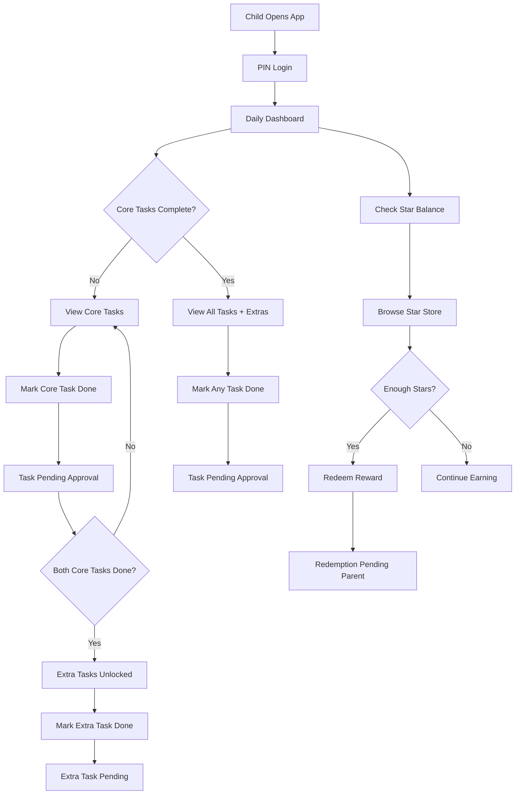
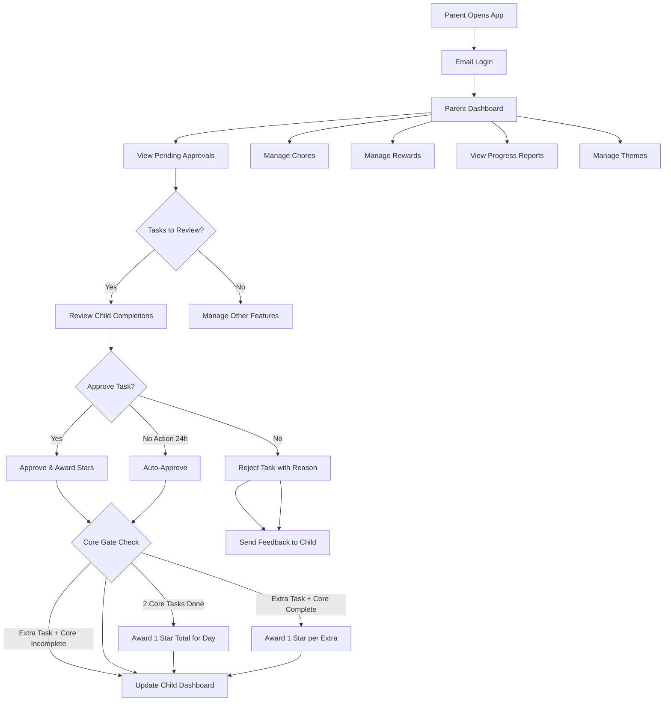
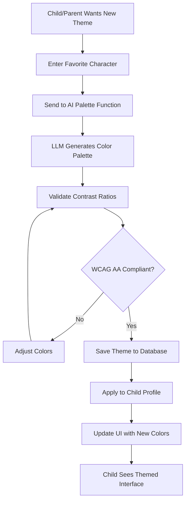
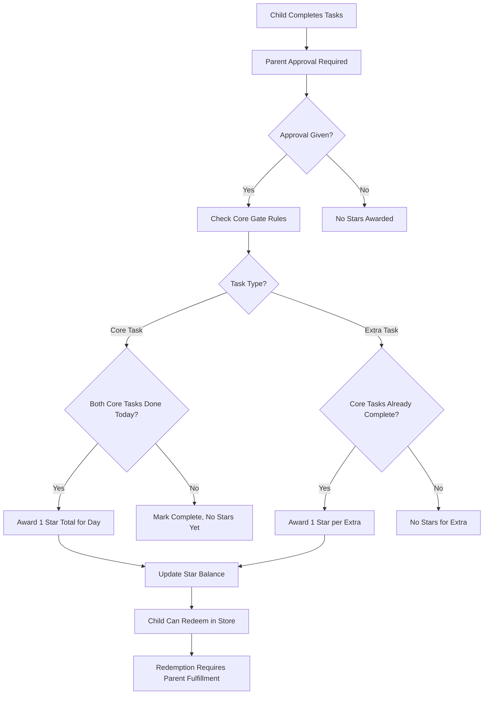

# 🏗️ System Architecture Document (SAD) – StarqueZZ

## Summary

StarqueZZ is a PWA that gamifies chores for kids (5–8) with a parent-approval gate, a star economy, and AI-generated color themes. The architecture prioritizes offline-first, security via RLS, and simple ops using React + Vite on the client and Supabase (Postgres, Auth, Edge Functions) on the backend.

---

## 1. Architecture Goals & Quality Attributes

- **Offline-first UX**: chores can be viewed/marked offline; sync on reconnect
- **Data integrity**: server-enforced rules (core-gate, 50% bonus) via functions/DB
- **Security**: parent email auth, child short-lived PIN token, Postgres RLS
- **Performance**: <2s initial load on mid devices, smooth interactions
- **Maintainability**: clean modular boundaries, typed contracts, minimal infra
- **Observability**: basic logging/metrics, error capture and replay

---

## 2. High-Level Architecture

### Clients
- **PWA (React + Vite)**: Tailwind CSS + ShadCN UI + TweakCN themes, Workbox SW, Dexie (IndexedDB), TanStack Query

### Backend (Supabase)
- **Auth**: email/password for parent, JWT. Child PIN token via Edge Function
- **Database**: Postgres with RLS policies
- **Edge Functions**: chore approval, star ledger updates, weekly bonus job, AI palette generation proxy, push broadcast
- **Storage**: (optional) for avatars/theme assets (not used for IP content)

### Services
- **Web Push**: VAPID keys; push via Edge Function
- **LLM/AI Palette**: server-side call (guardrails) that returns only color palettes + labels

### Hosting/CI
- **Frontend**: Vercel/Netlify
- **Supabase**: Managed
- **CI**: GitHub Actions (lint/test/build/deploy)

### Architecture Diagram
```
[React PWA]
  ├─ Service Worker (Workbox)
  ├─ IndexedDB (Dexie)
  ├─ UI Layer (ShadCN + TweakCN themes)
  └─ HTTP/WS → [Supabase: Auth, Postgres (RLS), Edge Functions] → [Push, AI Palette]
```

---

## 3. Component Responsibilities

### 3.1 PWA (Frontend)
- **UI Shell**: child mode (PIN), parent mode (email session), theme tokens
- **Data layer**: TanStack Query (cache, retries), background sync hooks
- **Offline queue**: Dexie tables for actions (mark done, redeem) with replay
- **Theming**: apply CSS token set per child; contrast guard; TweakCN theme integration
- **Push**: register service worker, store subscription, handle notifications
- **UI Components**: ShadCN base components with TweakCN Neo-Brutalism theme

```
index.css
:root {
  --background: oklch(1.0000 0 0);
  --foreground: oklch(0 0 0);
  --card: oklch(1.0000 0 0);
  --card-foreground: oklch(0 0 0);
  --popover: oklch(1.0000 0 0);
  --popover-foreground: oklch(0 0 0);
  --primary: oklch(0.6489 0.2370 26.9728);
  --primary-foreground: oklch(1.0000 0 0);
  --secondary: oklch(0.9680 0.2110 109.7692);
  --secondary-foreground: oklch(0 0 0);
  --muted: oklch(0.9551 0 0);
  --muted-foreground: oklch(0.3211 0 0);
  --accent: oklch(0.5635 0.2408 260.8178);
  --accent-foreground: oklch(1.0000 0 0);
  --destructive: oklch(0 0 0);
  --destructive-foreground: oklch(1.0000 0 0);
  --border: oklch(0 0 0);
  --input: oklch(0 0 0);
  --ring: oklch(0.6489 0.2370 26.9728);
  --chart-1: oklch(0.6489 0.2370 26.9728);
  --chart-2: oklch(0.9680 0.2110 109.7692);
  --chart-3: oklch(0.5635 0.2408 260.8178);
  --chart-4: oklch(0.7323 0.2492 142.4953);
  --chart-5: oklch(0.5931 0.2726 328.3634);
  --sidebar: oklch(0.9551 0 0);
  --sidebar-foreground: oklch(0 0 0);
  --sidebar-primary: oklch(0.6489 0.2370 26.9728);
  --sidebar-primary-foreground: oklch(1.0000 0 0);
  --sidebar-accent: oklch(0.5635 0.2408 260.8178);
  --sidebar-accent-foreground: oklch(1.0000 0 0);
  --sidebar-border: oklch(0 0 0);
  --sidebar-ring: oklch(0.6489 0.2370 26.9728);
  --font-sans: DM Sans, sans-serif;
  --font-serif: ui-serif, Georgia, Cambria, "Times New Roman", Times, serif;
  --font-mono: Space Mono, monospace;
  --radius: 0px;
  --shadow-2xs: 4px 4px 0px 0px hsl(0 0% 0% / 0.50);
  --shadow-xs: 4px 4px 0px 0px hsl(0 0% 0% / 0.50);
  --shadow-sm: 4px 4px 0px 0px hsl(0 0% 0% / 1.00), 4px 1px 2px -1px hsl(0 0% 0% / 1.00);
  --shadow: 4px 4px 0px 0px hsl(0 0% 0% / 1.00), 4px 1px 2px -1px hsl(0 0% 0% / 1.00);
  --shadow-md: 4px 4px 0px 0px hsl(0 0% 0% / 1.00), 4px 2px 4px -1px hsl(0 0% 0% / 1.00);
  --shadow-lg: 4px 4px 0px 0px hsl(0 0% 0% / 1.00), 4px 4px 6px -1px hsl(0 0% 0% / 1.00);
  --shadow-xl: 4px 4px 0px 0px hsl(0 0% 0% / 1.00), 4px 8px 10px -1px hsl(0 0% 0% / 1.00);
  --shadow-2xl: 4px 4px 0px 0px hsl(0 0% 0% / 2.50);
  --tracking-normal: 0em;
  --spacing: 0.25rem;
}

.dark {
  --background: oklch(0 0 0);
  --foreground: oklch(1.0000 0 0);
  --card: oklch(0.3211 0 0);
  --card-foreground: oklch(1.0000 0 0);
  --popover: oklch(0.3211 0 0);
  --popover-foreground: oklch(1.0000 0 0);
  --primary: oklch(0.7044 0.1872 23.1858);
  --primary-foreground: oklch(0 0 0);
  --secondary: oklch(0.9691 0.2005 109.6228);
  --secondary-foreground: oklch(0 0 0);
  --muted: oklch(0.3211 0 0);
  --muted-foreground: oklch(0.8452 0 0);
  --accent: oklch(0.6755 0.1765 252.2592);
  --accent-foreground: oklch(0 0 0);
  --destructive: oklch(1.0000 0 0);
  --destructive-foreground: oklch(0 0 0);
  --border: oklch(1.0000 0 0);
  --input: oklch(1.0000 0 0);
  --ring: oklch(0.7044 0.1872 23.1858);
  --chart-1: oklch(0.7044 0.1872 23.1858);
  --chart-2: oklch(0.9691 0.2005 109.6228);
  --chart-3: oklch(0.6755 0.1765 252.2592);
  --chart-4: oklch(0.7395 0.2268 142.8504);
  --chart-5: oklch(0.6131 0.2458 328.0714);
  --sidebar: oklch(0 0 0);
  --sidebar-foreground: oklch(1.0000 0 0);
  --sidebar-primary: oklch(0.7044 0.1872 23.1858);
  --sidebar-primary-foreground: oklch(0 0 0);
  --sidebar-accent: oklch(0.6755 0.1765 252.2592);
  --sidebar-accent-foreground: oklch(0 0 0);
  --sidebar-border: oklch(1.0000 0 0);
  --sidebar-ring: oklch(0.7044 0.1872 23.1858);
  --font-sans: DM Sans, sans-serif;
  --font-serif: ui-serif, Georgia, Cambria, "Times New Roman", Times, serif;
  --font-mono: Space Mono, monospace;
  --radius: 0px;
  --shadow-2xs: 4px 4px 0px 0px hsl(0 0% 0% / 0.50);
  --shadow-xs: 4px 4px 0px 0px hsl(0 0% 0% / 0.50);
  --shadow-sm: 4px 4px 0px 0px hsl(0 0% 0% / 1.00), 4px 1px 2px -1px hsl(0 0% 0% / 1.00);
  --shadow: 4px 4px 0px 0px hsl(0 0% 0% / 1.00), 4px 1px 2px -1px hsl(0 0% 0% / 1.00);
  --shadow-md: 4px 4px 0px 0px hsl(0 0% 0% / 1.00), 4px 2px 4px -1px hsl(0 0% 0% / 1.00);
  --shadow-lg: 4px 4px 0px 0px hsl(0 0% 0% / 1.00), 4px 4px 6px -1px hsl(0 0% 0% / 1.00);
  --shadow-xl: 4px 4px 0px 0px hsl(0 0% 0% / 1.00), 4px 8px 10px -1px hsl(0 0% 0% / 1.00);
  --shadow-2xl: 4px 4px 0px 0px hsl(0 0% 0% / 2.50);
}

@theme inline {
  --color-background: var(--background);
  --color-foreground: var(--foreground);
  --color-card: var(--card);
  --color-card-foreground: var(--card-foreground);
  --color-popover: var(--popover);
  --color-popover-foreground: var(--popover-foreground);
  --color-primary: var(--primary);
  --color-primary-foreground: var(--primary-foreground);
  --color-secondary: var(--secondary);
  --color-secondary-foreground: var(--secondary-foreground);
  --color-muted: var(--muted);
  --color-muted-foreground: var(--muted-foreground);
  --color-accent: var(--accent);
  --color-accent-foreground: var(--accent-foreground);
  --color-destructive: var(--destructive);
  --color-destructive-foreground: var(--destructive-foreground);
  --color-border: var(--border);
  --color-input: var(--input);
  --color-ring: var(--ring);
  --color-chart-1: var(--chart-1);
  --color-chart-2: var(--chart-2);
  --color-chart-3: var(--chart-3);
  --color-chart-4: var(--chart-4);
  --color-chart-5: var(--chart-5);
  --color-sidebar: var(--sidebar);
  --color-sidebar-foreground: var(--sidebar-foreground);
  --color-sidebar-primary: var(--sidebar-primary);
  --color-sidebar-primary-foreground: var(--sidebar-primary-foreground);
  --color-sidebar-accent: var(--sidebar-accent);
  --color-sidebar-accent-foreground: var(--sidebar-accent-foreground);
  --color-sidebar-border: var(--sidebar-border);
  --color-sidebar-ring: var(--sidebar-ring);

  --font-sans: var(--font-sans);
  --font-mono: var(--font-mono);
  --font-serif: var(--font-serif);

  --radius-sm: calc(var(--radius) - 4px);
  --radius-md: calc(var(--radius) - 2px);
  --radius-lg: var(--radius);
  --radius-xl: calc(var(--radius) + 4px);

  --shadow-2xs: var(--shadow-2xs);
  --shadow-xs: var(--shadow-xs);
  --shadow-sm: var(--shadow-sm);
  --shadow: var(--shadow);
  --shadow-md: var(--shadow-md);
  --shadow-lg: var(--shadow-lg);
  --shadow-xl: var(--shadow-xl);
  --shadow-2xl: var(--shadow-2xl);
}
```

### 3.2 Supabase Edge Functions
- **childLogin**: verify child PIN → short-lived JWT with role=child claim (4 digits, 5 attempts/15min lockout, 12h expiry)
- **approveCompletions**: parent approves pending → apply core gate, extra rules, create star transactions
- **autoApprovalCron**: daily job to auto-approve pending completions >24h
- **weeklyBonus (cron)**: compute perfect week + apply 50% of total stars (core + extras)
- **generatePalette**: OpenAI GPT-4 call with prompt ("favorite character") → return validated palette tokens (~$0.03/request)
- **validateThemeAdjustment**: check WCAG AA contrast when parent modifies AI-generated colors
- **pushBroadcast**: send reminders (chores due, streak status)

### 3.3 Database (Postgres)
- **RLS**: scope to parent or child claims
- **Constraints**: guard business rules (enum checks, unique-per-day, FK)
- **Views**: convenience views for dashboards (weekly rollups)

---

## 4. Data Model (ERD Sketch)

### Tables
- `parent(user_id PK, email UNIQUE, created_at)`
- `child(id PK, parent_id FK→parent.user_id, name, pin_hash, pin_attempts INT, pin_locked_until TIMESTAMP, theme_id FK, created_at)`
- `theme_palette(id PK, child_id FK, name, tokens JSONB, original_tokens JSONB, is_modified BOOL, contrast_ok BOOL, created_at)`
- `chore(id PK, parent_id FK, title, is_core BOOL, active BOOL)`
- `chore_assignment(id PK, child_id FK, chore_id FK, schedule JSONB, created_at)`
- `chore_completion(id PK, child_id FK, chore_id FK, date DATE, status TEXT CHECK (status IN ('pending','approved','rejected')), marked_by_child_at TIMESTAMP, approved_by_parent_at TIMESTAMP, auto_approved_at TIMESTAMP)`
- `star_transaction(id PK, child_id FK, delta INT, reason TEXT CHECK (reason IN ('core_day','extra','weekly_bonus','redeem')), metadata JSONB, created_at)`
- `reward(id PK, parent_id FK, title, cost_stars INT, active BOOL)`
- `reward_redemption(id PK, child_id FK, reward_id FK, cost_stars INT, status TEXT CHECK (status IN ('pending','fulfilled','cancelled','expired')), created_at, fulfilled_at, expired_at TIMESTAMP)`
- `push_sub(id PK, owner_type TEXT CHECK (owner_type IN ('parent','child')), owner_id UUID, endpoint TEXT, p256dh TEXT, auth TEXT, created_at)`

### Key Rules Encoded
- Unique `(child_id, chore_id, date)` in `chore_completion`
- Weekly bonus job scans `chore_completion` for 7-day core completion streaks
- Ledger (`star_transaction`) is append-only

---

## 5. API Surface (selected)

### Auth
- `POST /auth/parent/signin` → Supabase Auth
- `POST /auth/child/login` → returns short-lived child JWT

### Chores
- `GET /child/:id/chores?date=YYYY-MM-DD`
- `POST /child/:id/chores/:choreId/markDone` (child JWT) → create chore_completion (pending)
- `POST /parent/approvals` (parent JWT) → approve/reject list of completions with reason; function applies stars
- `GET /parent/auto-approvals` → list completions pending >24h for auto-approval

### Stars & Rewards
- `GET /child/:id/stars/balance`
- `GET /rewards` (parent)
- `POST /redeem` (child → pending, parent fulfills)

### Themes
- `POST /theme/generate {prompt}` → `{tokens}` (OpenAI GPT-4, ~$0.03/request)
- `POST /theme/:id/adjust {color_overrides}` → validates WCAG AA contrast
- `POST /child/:id/theme/apply {theme_id}`

### Push
- `POST /push/subscribe` → save subscription
- `POST /push/remind` (system/cron) → broadcast reminders

---

## 6. Sequence Flows

### 6.1 Child Marks Chore → Parent Approval → Stars
1. Child (offline/online) taps Mark Done → enqueue completion locally
2. SW/Sync → POST to markDone → creates chore_completion(status=pending)
3. Parent dashboard shows pending items
4. Parent selects items → approveCompletions function:
   - Validate child's two core chores completed today → +1 star total (once daily)
   - If core gate passed, each extra completion today → +1 star
   - Create star_transaction rows accordingly
   - Update completion status to approved
5. **Rejection Path**: Parent rejects → status=rejected, child notified with reason, task resets
6. **Auto-Approval Path**: autoApprovalCron runs daily → pending >24h → auto-approve, notify child

### 6.2 Weekly Bonus
1. Cron triggers weeklyBonus
2. For each child: scan last 7 days → if core completed all 7 days, compute 50% of total stars earned that week (core + extras)
3. Insert star_transaction(reason='weekly_bonus', delta=round(total_week_stars*0.5))
4. Example: 7 core stars + 5 extra stars = 12 total → bonus = 6 stars

### 6.3 Theme Generation & Customization
1. Child/Parent enters favorite character
2. generatePalette calls OpenAI GPT-4 with guardrails → returns palette tokens only
3. Client applies tokens to CSS variables; store in theme_palette
4. TweakCN theme integration: override base theme with AI-generated colors
5. **Manual Adjustment**: Parent modifies colors → validateThemeAdjustment checks WCAG AA → apply if valid
6. Store both original_tokens and modified tokens with is_modified flag

### 6.4 Redemption Fulfillment & Expiry
1. Child redeems reward → status=pending, stars deducted
2. Parent fulfills physical reward → status=fulfilled, fulfilled_at timestamp
3. **Auto-Expiry**: Daily cron checks redemptions pending >7 days → status=expired, stars refunded
4. **Cancellation**: Parent/child can cancel → status=cancelled, stars refunded

### 6.5 Tutorial Onboarding Sequence
1. First child login → trigger tutorial mode
2. Welcome screen with character introduction
3. Explain core tasks (must complete both)
4. Show extra tasks (unlock after cores)
5. Demonstrate marking tasks complete
6. Show Star Store preview
7. Explain weekly bonus system
8. Complete tutorial → normal app mode

---

## 7. Offline & Sync Strategy

- **Caching**: App shell + chore lists cached via Workbox
- **Queues**: Dexie action tables (completionQueue, redeemQueue)
- **Background Sync**: flush queues when online; retries with backoff
- **Conflict Handling**: server is source of truth; client reconciles statuses
- **Optimistic UI**: show "Pending approval" badge immediately

---

## 8. Security & Privacy

- **Auth**: Parent email/password (Supabase). Child JWT via PIN; 12h TTL
- **PIN Security**: 4 digits, bcrypt hashed, 5 attempts/15min lockout, parent can reset
- **RLS**: All tables enforce parent/child scoping
- **Secrets**: Edge Functions keep VAPID keys and OpenAI API keys
- **Rate Limits**: PIN attempts, markDone frequency, function invocations
- **PII**: Minimal collection; no PII in push payloads

---

## 9. Non-Functional Requirements

- **Performance**: TTI < 2s on mid phones; bundle splitting; image lazy-load
- **Reliability**: At-least-once delivery for queued actions; idempotent functions
- **Accessibility**: WCAG AA; theme contrast validator; large tap targets
- **Compatibility**: iOS/Android/Chrome/Edge/Safari as installed PWAs
- **Scalability**: Start with Supabase; can migrate to Node/Nest + RDS later
- **Cost Management**: OpenAI palette generation ~$0.03/request; estimate $5-15/month for 2 children with theme changes

---

## 10. Deployment & Environments

- **Envs**: Dev, Staging, Prod (separate Supabase projects & DBs)
- **CI/CD**: PR previews; migrations via supabase/migrations
- **Config**: Env vars for API keys, VAPID, LLM provider

---

## 11. Observability

- **Frontend**: Sentry (errors), Web Vitals, simple logs
- **Backend**: Supabase logs; function structured logging; audit tables
- **Dashboards**: Weekly earned/bonus/redemptions; approval latency

---

## 12. Risks & Mitigations

- **Push on iOS**: requires installed PWA → show onboarding to install; fallback to email for parents
- **LLM variability**: guardrails & schema validation for palette; fallback to deterministic mapping
- **Offline conflicts**: idempotent server functions; client reconciliation
- **IP concerns**: palettes only; no logos/characters

---

## 13. Future Extensions

- Move to Node/Nest with Redis jobs when scale needs grow
- Realtime subscriptions for instant dashboards
- Analytics-based dynamic rewards to reduce drop-off

---

## 14. Resolved Decisions

- **LLM Provider**: OpenAI GPT-4 for palette generation (~$0.03/request, reliable, good guardrails)
- **Schedule Format**: Simple day-of-week booleans (sufficient for MVP)
- **Notification Policy**: 4PM daily reminder, immediate rewards, Sunday streaks, 8PM-8AM quiet hours, max 3/day
- **Theme Customization**: AI-generated base + parent color adjustments with WCAG AA validation
- **Auto-Approval**: 24-hour timeout for pending completions
- **Weekly Bonus**: 50% of total stars earned that week (core + extras)
- **Redemption Expiry**: 7-day auto-cancel with star refund

---

## 15. UI/UX Architecture

### 15.1 Design System
- **Base Framework**: Tailwind CSS for utility-first styling
- **Component Library**: ShadCN UI for consistent, accessible components
- **Theme System**: TweakCN Neo-Brutalism as base theme with AI-generated overrides
- **Responsive Design**: Mobile-first approach with PWA optimization

### 15.2 Theme Integration
- **Base Theme**: TweakCN Neo-Brutalism provides consistent design foundation
- **AI Overrides**: Child-specific color palettes override base theme variables
- **Contrast Validation**: Ensure accessibility compliance with WCAG AA standards
- **Theme Persistence**: Store theme preferences in database and localStorage

### 15.3 Component Architecture
- **ShadCN Base Components**: Button, Card, Dialog, Form, etc.
- **Custom Components**: ChoreCard, StarDisplay, RewardItem, ThemeSelector
- **Theme-aware Components**: Automatically adapt to child's selected theme
- **Accessibility**: Large tap targets, high contrast, screen reader support

---

## 16. User Flow Diagrams

### 16.1 Child Daily Flow


### 16.2 Parent Approval Flow


### 16.3 Weekly Bonus Flow
```mermaid
flowchart TD
    A[Sunday Night Cron] --> B[Scan All Children]
    B --> C[Check Last 7 Days]
    C --> D{Core Tasks Complete All 7 Days?}
    D -->|Yes| E[Calculate Total Week Stars (Core + Extras)]
    D -->|No| F[No Bonus This Week]
    
    E --> G[Apply 50% Bonus]
    G --> H[Create Bonus Transaction]
    H --> I[Send Congratulations Push]
    
    F --> J[Send Encouragement Push]
    
    I --> K[Update Child Dashboard]
    J --> K
```

### 16.4 Theme Generation Flow


### 16.5 Star Economy Flow


---

This SAD defines the MVP technical blueprint for StarqueZZ.